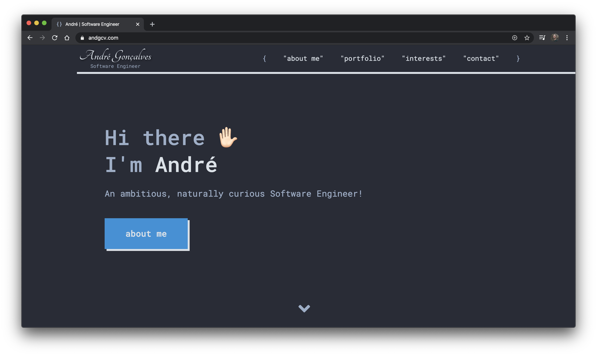

  

<h1 align="center">
  My Personal Website
  
</h1>

My personal website where you can connect with me, get to know me a little better and see what I’ve been up to lately! I wanted something easy to use, easy to maintain and with good SEO, and considering the fact that I had previous experience with React, Gatsby seemed like a great fit!

<h4 align="center">React - Gatsby - GraphQL - Styled-components - Git</h4>

<h2 align="center"><a href="https://www.andgcv.com/">Check it live here</a></h2>

